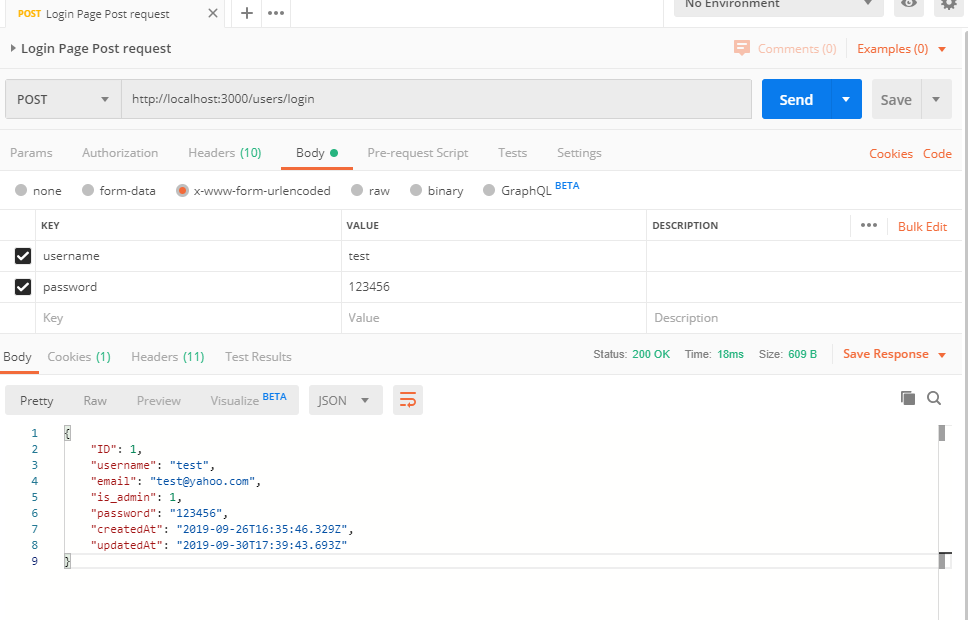
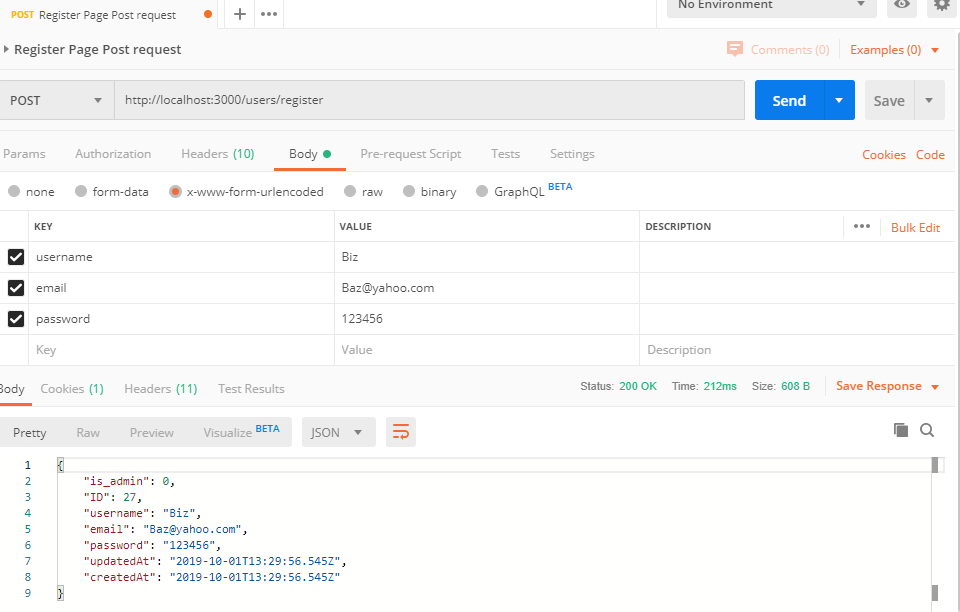
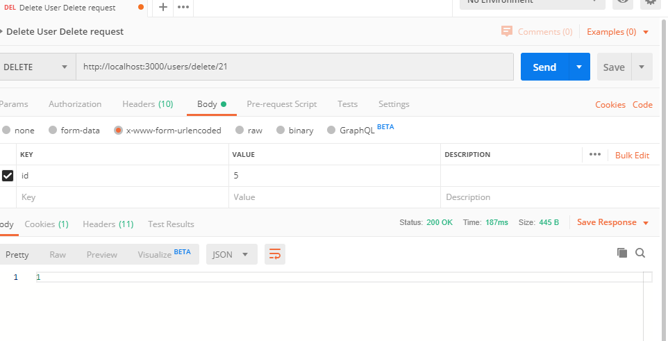
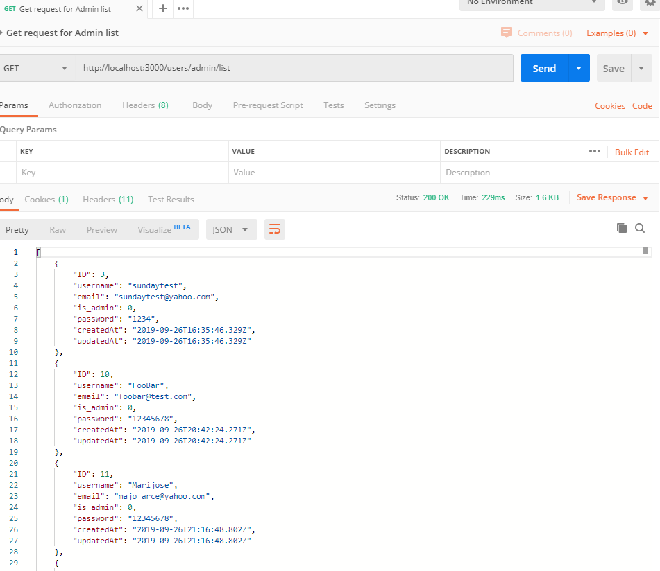
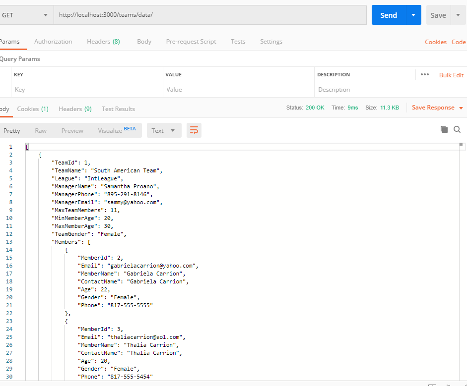

# Soccer Academy

- Back-end server side implemeneted using express generator.

### Install Module

  + npm install express-generator -g

#### Generate the App

* cd A_WORKING_DIR_OF_YOUR_CHOIDE
* npm install
* To run the server: npm run dev

#### Routes

 Login Post request:

+ Post request : http://localhost:3000/users/login

  Register Post request:

+ Post request : http://localhost:3000/users/register

 List Users by ID Get request:

+ Get request : http://localhost:3000/users/id 

Edit email put request:

+ Get request : http://localhost:3000/users/edit/2

+ Delete : http://localhost:3000/users/delete/id

+ Get request: http://localhost:3000/users/admin/list

+ Get request: http://localhost:3000/users/teams/data/

